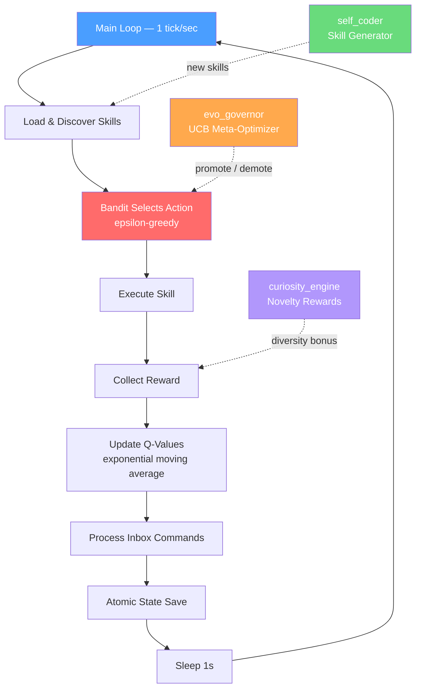

[](https://github.com/Bailie-L/Guy/actions/workflows/ci.yml)

# Guy — Self-Evolving AI Agent Framework

A lightweight, zero-dependency AI agent that learns which actions to take over time using reinforcement learning. Guy implements an epsilon-greedy multi-armed bandit algorithm with hot-loadable skills and the unique ability to generate, evaluate, and retire its own behaviors autonomously.

**1.2 million+ ticks of continuous operation. Zero external dependencies.**

---

## Overview

Guy runs a continuous loop executing one "tick" per second. Each tick it selects an action (skill) via the bandit algorithm, executes it, receives a reward, and updates Q-values that guide future decisions. Over time, the agent learns which skills produce the best outcomes and favors them — while still exploring alternatives.

Originally developed as the brain for the FreeGuy AI Companion project.

## Architecture



## Operational Snapshot

After 1.2M+ ticks of continuous learning:

```
Top Q-Values
─────────────────────────────────────────
mc_move_to_air    ████████░░  0.0800
wolf_actions      ██░░░░░░░░  0.0200
wolf_unstuck      ██░░░░░░░░  0.0185
signal            ██░░░░░░░░  0.0177
wolf_follow       █░░░░░░░░░  0.0165
dream             █░░░░░░░░░  0.0153
heartbeat         █░░░░░░░░░  0.0102

Ticks: 1,203,275 | Skills: 91 (51 auto-generated)
Epsilon: 0.25    | Alpha: 0.3
```

## Features

- **Zero Dependencies** — Runs on Python 3.10+ standard library only, no pip installs needed
- **Hot-Loadable Skills** — Drop a `.py` file into `skills/` and it loads within 10 seconds, no restart required
- **Self-Evolution** — Auto-generates new skills, tests them, promotes winners, retires losers
- **Meta-Learning** — UCB-based evolutionary governor optimizes the learning process itself
- **Crash-Resistant** — Atomic state saves every tick, graceful signal handling, corruption recovery
- **Observable** — Every action logged as JSON, monitoring dashboard included

## Quick Start
```bash
# Clone the repository
git clone https://github.com/YOUR_USERNAME/guy_test.git
cd guy_test

# No virtual environment needed (stdlib only), but if you prefer:
python3 -m venv venv && source venv/bin/activate

# Create data directory (auto-created on first run)
mkdir -p data skills

# Start the agent
python main.py

# Run in background
nohup python main.py &

# Monitor status
./check_guy.sh

# Stop gracefully
echo "quit" >> data/inbox.txt
```

## How It Works

### The Bandit Algorithm

Guy uses **epsilon-greedy** action selection:

- With probability **ε** (default 0.25): choose a random action (explore)
- With probability **1-ε**: choose the action with the highest Q-value (exploit)

After each action, Q-values update via exponential moving average:
Q[action] = (1 - α) * Q[action] + α * reward

| Parameter | Default | Description |
|-----------|---------|-------------|
| `epsilon` | 0.25 | Exploration rate — 25% random actions |
| `alpha` | 0.3 | Learning rate — how fast Q-values change |
| `tick_interval` | 1.0s | Time between actions |

### Skills

Skills are Python files in `skills/` that follow a simple contract:
```python
# skills/skill_example.py
ACT_NAME = "example"

def act(ctx):
    """
    ctx["state"] — full agent state (Q-values, ticks, notes, etc.)
    ctx["time"]  — current Unix timestamp

    Returns:
        float > 0  → positive reward (action becomes more likely)
        float < 0  → negative reward (action becomes less likely)
        0.0        → neutral
        None       → skip update
    """
    state = ctx["state"]
    return 0.05
```

Drop this file into `skills/` and it auto-loads within 10 seconds.

### Skill Categories

| Category | Examples | Purpose |
|----------|----------|---------|
| Utility | `heartbeat`, `compress_memory` | Basic maintenance |
| Meta-Learning | `evo_governor`, `policy_optimizer` | Optimize learning |
| Diversity | `curiosity_engine`, `entropy_guardian` | Prevent action dominance |
| Safety | `escape_trap`, `survival_reflexes` | Recover from bad states |
| Auto-Generated | `auto_skill_*` | Self-created experimental skills |

### Self-Evolution

Guy creates its own skills through a pipeline:

1. **Generate** — `self_coder` creates new `skill_auto_skill_*.py` files
2. **Register** — Tracked in `data/self_coder_registry.json`
3. **Evaluate** — Bandit tests the skill during normal operation
4. **Promote/Retire** — `evo_governor` promotes good skills, `auto_blocklist` retires bad ones

## External Commands

Send commands by writing to `data/inbox.txt`:
```bash
# Reward an action
echo "reward my_skill 0.1" >> data/inbox.txt

# Penalize an action
echo "reward bad_skill -0.05" >> data/inbox.txt

# Add a note
echo "note Manual intervention at $(date)" >> data/inbox.txt

# Adjust learning rate
echo "set alpha 0.2" >> data/inbox.txt

# Shutdown
echo "quit" >> data/inbox.txt
```

## Monitoring

Run the built-in dashboard:
```bash
./check_guy.sh
```

This shows process status, Q-value rankings, heartbeat analysis, Shannon entropy for action diversity, error scanning, and overall health assessment.

View learned values:
```bash
python tools/guy_learned.py
```

## Project Structure
guy_test/
├── main.py                  # Core agent loop (~288 lines)
├── check_guy.sh             # Monitoring dashboard
├── README.md                # This file
├── LICENSE                  # MIT License
│
├── data/                    # Persistent data (auto-created)
│   ├── state.json           # Agent state & Q-values
│   ├── events.log           # JSON event log
│   ├── events-.log.gz      # Rotated logs (7 kept)
│   ├── inbox.txt            # External command queue
│   ├── outbox/              # Agent messages
│   ├── evo_governor.json    # Meta-optimizer state
│   └── memory_bank.json     # Long-term memory
│
├── skills/                  # Hot-loadable skills
│   ├── skill_curiosity_engine.py
│   ├── skill_evo_governor.py
│   ├── skill_auto_skill_.py
│   └── ...
│
└── tools/                   # Utilities
├── guy_learned.py       # Status reporter
├── guy_notifier.py      # Desktop notifications
└── guy_cheatsheet.txt   # Quick reference

## State Schema
```json
{
  "version": 1,
  "ticks": 1203275,
  "epsilon": 0.25,
  "alpha": 0.3,
  "q": { "heartbeat": 0.01, "my_skill": 0.05 },
  "n": { "heartbeat": 450000, "my_skill": 1200 },
  "last_actions": [],
  "notes": []
}
```

## Requirements

- **Python 3.10+**
- No external packages (stdlib only)
- POSIX system recommended (Linux/macOS) for atomic file operations

## Statistics

| Metric | Value |
|--------|-------|
| Core lines of code | ~288 |
| Total skills | 89+ |
| Auto-generated skills | 51 |
| Total ticks executed | 1,203,275+ |
| External dependencies | 0 |

## License

This project is licensed under the MIT License — see [LICENSE](LICENSE) for details.


Built as part of the FreeGuy AI Companion project.

